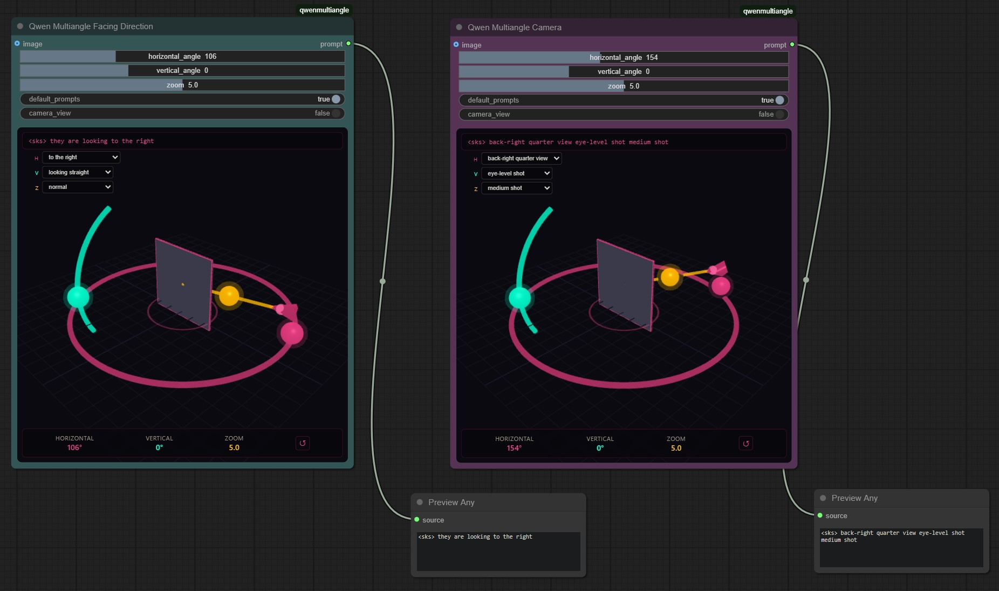

# ComfyUI-AnglePrompts

A ComfyUI custom node suite for 3D camera angle and gaze direction control. Provides interactive Three.js viewports to adjust camera angles or subject gaze directions and outputs formatted prompt strings for multi-angle image generation.

## Features

- **Two Interactive 3D Control Nodes**:
  - **Qwen Multiangle Camera** - Adjust camera angles with drag handles in the Three.js viewport
  - **Qwen Multiangle Facing Direction** - Control subject gaze directions with the same interactive interface
- **Interactive 3D Controls** - Drag handles in the Three.js viewport to adjust:
  - Horizontal angle (azimuth): 0° - 360°
  - Vertical angle (elevation): -30° to 60°
  - Zoom level: 0 - 10
- **Quick Select Dropdowns** - Three dropdown menus for quickly selecting preset angles/directions:
  - Camera: front view, quarter views, side views, back view
  - Facing: straight ahead, to the right/left, backwards directions
  - Elevation: low-angle, eye-level, elevated, high-angle shots (both nodes)
  - Distance: wide shot, medium shot, close-up (both nodes)
- **Real-time Preview** - Connect an image input to see it displayed in the 3D scene as a card with proper color rendering
- **Camera View Mode** - Toggle `camera_view` to preview the scene from the camera indicator's perspective, with interactive orbit controls (drag to rotate, scroll to zoom)
- **Dual Prompt Outputs**:
  - Camera node: Camera angle prompts compatible with [Qwen-Image-Edit-2511-Multiple-Angles-LoRA](https://huggingface.co/fal/Qwen-Image-Edit-2511-Multiple-Angles-LoRA)
  - Facing node: Gaze direction prompts for character/subject posing
- **Bidirectional Sync** - Slider widgets, 3D handles, and dropdowns stay synchronized
- **Multi-language Support** - UI labels available in English, Chinese, Japanese, and Korean (auto-detected from ComfyUI settings)

## Installation

1. Navigate to your ComfyUI custom nodes folder:
   ```bash
   cd ComfyUI/custom_nodes
   ```

2. Clone this repository:
   ```bash
   git clone https://github.com/jtydhr88/ComfyUI-qwenmultiangle.git
   ```

3. Restart ComfyUI

4. Download LoRA from https://huggingface.co/fal/Qwen-Image-Edit-2511-Multiple-Angles-LoRA/tree/main into your lora folder

## Development

This project uses TypeScript and Vite for building the frontend. The 3D viewport is built with Three.js.

### Prerequisites

- Node.js 18+
- npm

### Build

```bash
# Install dependencies
npm install

# Build for production
npm run build

# Build with watch mode (for development)
npm run dev

# Type check
npm run typecheck
```

### Project Structure

```
ComfyUI-qwenmultiangle/
├── src/
│   ├── main.ts           # Extension entry point - handles both camera and facing nodes
│   ├── CameraWidget.ts   # Three.js interactive widget (camera + facing modes)
│   ├── i18n.ts           # Internationalization (en/zh/ja/ko) - supports both node types
│   ├── styles.ts         # CSS styles for 3D interface
│   └── types.ts          # TypeScript type definitions
├── js/                   # Build output (committed for distribution)
│   └── main.js
├── nodes.py              # ComfyUI node definitions (camera + facing direction)
├── __init__.py           # Python module init
├── package.json
├── tsconfig.json
└── vite.config.mts
```

## Usage

### Camera Angle Control
1. Add the **Qwen Multiangle Camera** node from the `image/multiangle` category
2. Optionally connect an IMAGE input to preview in the 3D scene
3. Adjust camera angles by:
   - Dragging the colored handles in the 3D viewport
   - Using the slider widgets
   - Selecting preset values from the dropdown menus
4. Toggle `camera_view` to see the preview from the camera's perspective
5. The node outputs a prompt string describing the camera angle

### Subject Gaze Direction Control
1. Add the **Qwen Multiangle Facing Direction** node from the `image/multiangle` category
2. Use the same interactive controls as the camera node
3. The node outputs gaze direction prompts like "they are looking up and to the right"
4. Combine with camera angles for complete scene control

### Widgets

Both nodes share the same widget interface:

| Widget | Type | Description |
|--------|------|-------------|
| horizontal_angle | Slider | Azimuth angle (0° - 360°) - camera direction or gaze direction |
| vertical_angle | Slider | Elevation angle (-30° to 60°) - camera elevation or gaze elevation |
| zoom | Slider | Distance/zoom level (0 - 10) - affects prompt proximity |
| default_prompts | Checkbox | **Deprecated** - Kept for backward compatibility only, has no effect |
| camera_view | Checkbox | Preview scene from camera's perspective (same for both nodes) |

### 3D Viewport Controls

| Handle | Color | Control |
|--------|-------|---------|
| Ring handle | Pink | Horizontal angle (azimuth) |
| Arc handle | Cyan | Vertical angle (elevation) |
| Line handle | Gold | Zoom/distance |

The image preview displays as a card - front shows the image, back shows a grid pattern when viewed from behind.

### Camera View Mode Controls

When `camera_view` is enabled, you can interactively control the camera using mouse:

| Action | Control |
|--------|---------|
| Drag left/right | Rotate horizontally (azimuth) |
| Drag up/down | Rotate vertically (elevation) |
| Scroll up | Zoom in (increase distance) |
| Scroll down | Zoom out (decrease distance) |

All interactions respect the same limits as the sliders:
- Azimuth: 0° - 360° (wraps around)
- Elevation: -30° to 60°
- Distance: 0 - 10

Changes made via orbit controls automatically sync with the slider widgets.

### Quick Select Dropdowns

Three dropdown menus are available in the 3D viewport for quickly selecting preset angles/directions. Options differ between Camera and Facing Direction nodes:

**Camera Node:**
| Dropdown | Options |
|----------|---------|
| Horizontal (H) | front view, front-right quarter view, right side view, back-right quarter view, back view, back-left quarter view, left side view, front-left quarter view |
| Vertical (V) | low-angle shot, eye-level shot, elevated shot, high-angle shot |
| Distance (Z) | wide shot, medium shot, close-up |

**Facing Direction Node:**
| Dropdown | Options |
|----------|---------|
| Horizontal (H) | straight ahead, to the right, to the left, backwards to the right, backwards, backwards to the left |
| Vertical (V) | looking down, looking straight, looking up |
| Distance (Z) | far away, normal, closeby |

Selecting a preset will automatically update the 3D handles and slider widgets.

### Internationalization

The UI labels are automatically translated based on your ComfyUI language setting:

| Language | Code |
|----------|------|
| English | en |
| Chinese (Simplified) | zh |
| Japanese | ja |
| Korean | ko |

The output prompt is always in English regardless of the UI language.

### Output Prompt Formats

#### Camera Node
Outputs prompts compatible with [Qwen-Image-Edit-2511-Multiple-Angles-LoRA](https://huggingface.co/fal/Qwen-Image-Edit-2511-Multiple-Angles-LoRA):

```
<sks> {azimuth} {elevation} {distance}
```

Examples:
- `<sks> front view eye-level shot medium shot`
- `<sks> right side view high-angle shot close-up`
- `<sks> back-left quarter view low-angle shot wide shot`

**Camera Values:**
| Parameter | Values |
|-----------|--------|
| Azimuth | `front view`, `front-right quarter view`, `right side view`, `back-right quarter view`, `back view`, `back-left quarter view`, `left side view`, `front-left quarter view` |
| Elevation | `low-angle shot` (-30°), `eye-level shot` (0°), `elevated shot` (30°), `high-angle shot` (60°) |
| Distance | `wide shot`, `medium shot`, `close-up` |

#### Facing Direction Node
Outputs gaze direction prompts for character/subject posing:

```
<sks> they are looking {direction} {elevation} {distance}
```

Examples:
- `<sks> they are looking straight ahead`
- `<sks> they are looking up and to the right`
- `<sks> they are looking down and backwards closeby`
- `<sks> they are looking to the left far away`

**Facing Values:**
| Parameter | Values |
|-----------|--------|
| Direction | `straight ahead`, `to the right`, `to the left`, `backwards to the right`, `backwards`, `backwards to the left` |
| Elevation | `down` (-30°), `straight` (0°), `up` (30°+) |
| Distance | `far away`, `closeby` (or empty for normal distance) |

## Credits

### Original Implementation

This ComfyUI node is based on [qwenmultiangle](https://github.com/amrrs/qwenmultiangle), a standalone web application for camera angle control.

The original project was inspired by:
- [multimodalart/qwen-image-multiple-angles-3d-camera](https://huggingface.co/spaces/multimodalart/qwen-image-multiple-angles-3d-camera) on Hugging Face Spaces
- [fal.ai - Qwen Image Edit 2511 Multiple Angles](https://fal.ai/models/fal-ai/qwen-image-edit-2511-multiple-angles/)

## Related Projects

- [ComfyUI-qwenmultiangle-plus](https://github.com/cjlang2020/ComfyUI-qwenmultiangle-plus) - Another modified version based on this project

## License

MIT
